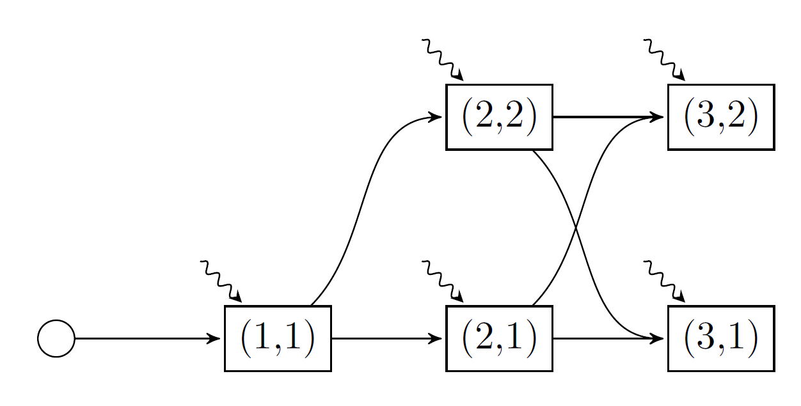

# Basic IV: Markov uncertainty

In our three tutorials ([Basic I: first steps](@ref),
[Basic II: adding uncertainty](@ref), and
[Basic III: objective uncertainty](@ref)), we formulated a simple
hydrothermal scheduling problem with stagewise-independent noise in the
right-hand side of the constraints and in the objective function. Now, in this
tutorial, we introduce some *stagewise-dependent* uncertainty using a Markov
chain.

## Formulating the problem

In this tutorial we consider a Markov chain with two *climate* states: wet and
dry. Each Markov state is associated with an integer, in this case the wet
climate state  is Markov state `1` and the dry climate state is Markov state
`2`. In the wet climate state, the probability of the high inflow increases to
50%, and the probability of the low inflow decreases to 1/6. In the dry climate
state, the converse happens. There is also persistence in the climate state: the
probability of remaining in the current state is 75%, and the probability of
transitioning to the other climate state is 25%. We assume that the first stage
starts in the wet climate state.

Here is a picture of the model we're going to implement.



There are five nodes in our graph. Each node is named by a tuple `(t, i)`, where
`t` is the stage for `t=1,2,3`, and `i` is the Markov state for `i=1,2`. As
before, the wavy lines denote the stagewise-independent random variable.

For each stage, we need to provide a Markov transition matrix. This is an
`M`x`N` matrix, where the element `A[i, j]` gives the probability of
transitioning from Markov state `i` in the previous stage to Markov state `j` in
the current stage. The first stage is special because we assume there is a
"zero'th" stage which has one Markov state (the round node in the graph above).
Furthermore, the number of columns in the transition matrix of a stage (i.e. the
number of Markov states) must equal the number of rows in the next stage's
transition matrix. For our example, the vector of Markov transition matrices is
given by:
```julia
T = Array{Float64, 2}[
    [ 1.0 ]',
    [ 0.75 0.25 ],
    [ 0.75 0.25 ; 0.25 0.75 ]
]
```

!!! note
    Make sure to add the `'` after the first transition matrix so Julia can
    distinguish between a vector and a matrix.

## Creating a model

```jldoctest tutorial_four
using Kokako, GLPK

Ω = [
    (inflow = 0.0, fuel_multiplier = 1.5),
    (inflow = 50.0, fuel_multiplier = 1.0),
    (inflow = 100.0, fuel_multiplier = 0.75)
]

model = Kokako.MarkovianPolicyGraph(
            transition_matrices = Array{Float64, 2}[
                [ 1.0 ]',
                [ 0.75 0.25 ],
                [ 0.75 0.25 ; 0.25 0.75 ]
            ],
            sense = :Min,
            lower_bound = 0.0,
            optimizer = with_optimizer(GLPK.Optimizer)
        ) do subproblem, node
    # Unpack the stage and Markov index.
    t, markov_state = node
    # Define the state variable.
    @variable(subproblem, 0 <= volume <= 200, Kokako.State, initial_value = 200)
    # Define the control variables.
    @variables(subproblem, begin
        thermal_generation >= 0
        hydro_generation   >= 0
        hydro_spill        >= 0
        inflow
    end)
    # Define the constraints
    @constraints(subproblem, begin
        volume.out == volume.in + inflow - hydro_generation - hydro_spill
        thermal_generation + hydro_generation == 150.0
    end)
    # Note how we can use `markov_state` to dispatch an `if` statement.
    probability = if markov_state == 1  # wet climate state
        [1/6, 1/3, 1/2]
    else  # dry climate state
        [1/2, 1/3, 1/6]
    end

    fuel_cost = [50.0, 100.0, 150.0]
    Kokako.parameterize(subproblem, Ω, probability) do ω
        JuMP.fix(inflow, ω.inflow)
        @stageobjective(subproblem,
            ω.fuel_multiplier * fuel_cost[t] * thermal_generation)
    end
end

# output

A policy graph with 5 nodes.
 Node indices: (1, 1), (2, 1), (2, 2), (3, 1), (3, 2)
```

!!! info
    For more information on [`Kokako.MarkovianPolicyGraph`](@ref)s, read
    [Intermediate III: policy graphs](@ref).

## Training and simulating the policy

As in the previous three tutorials, we train the policy:
```jldoctest tutorial_four; filter=[r"\|.+?\n", r"Confidence interval.+?\n"]
julia> Kokako.train(model; iteration_limit = 10)
———————————————————————————————————————————————————————————————————————————————
                        SDDP.jl - © Oscar Dowson, 2017-19.
———————————————————————————————————————————————————————————————————————————————
Numerical stability report
  Non-zero Matrix range     [1e+00, 1e+00]
  Non-zero Objective range  [1e+00, 2e+02]
  Non-zero Bounds range     [2e+02, 2e+02]
  Non-zero RHS range        [2e+02, 2e+02]
———————————————————————————————————————————————————————————————————————————————
 Iteration | Simulation |      Bound |   Time (s)
———————————————————————————————————————————————————————————————————————————————
         1 |     5.625K |     5.329K |     0.031
         2 |    11.250K |     7.975K |     0.034
         3 |     5.000K |     7.975K |     0.035
         4 |    22.440K |     8.073K |     0.068
         5 |     5.000K |     8.073K |     0.084
         6 |     5.000K |     8.073K |     0.087
         7 |     1.875K |     8.073K |     0.089
         8 |    13.125K |     8.073K |     0.092
         9 |    11.250K |     8.073K |     0.096
        10 |     1.875K |     8.073K |     0.099
———————————————————————————————————————————————————————————————————————————————
 Terminating training with status: iteration_limit
———————————————————————————————————————————————————————————————————————————————
```

Instead of performing a Monte Carlo simulation like the previous tutorials, we
may want to simulate one particular sequence of noise realizations. This
_historical_ simulation can also be conducted by passing a
[`Kokako.Historical`](@ref) sampling scheme to the `sampling_scheme` keyword of
the [`Kokako.simulate`](@ref) function.

We can confirm that the historical sequence of nodes was visited by querying
the `:node_index` key of the simulation results.

```jldoctest tutorial_four
simulations = Kokako.simulate(
    model,
    sampling_scheme = Kokako.Historical([
        ((1, 1), Ω[1]),
        ((2, 2), Ω[3]),
        ((3, 1), Ω[2])
    ])
)

[stage[:node_index] for stage in simulations[1]]

# output

3-element Array{Tuple{Int64,Int64},1}:
 (1, 1)
 (2, 2)
 (3, 1)
```

This concludes our fourth tutorial for `SDDP.jl`. In the next tutorial,
[Basic V: plotting](@ref) we discuss the plotting utilities included in
`SDDP.jl`.
